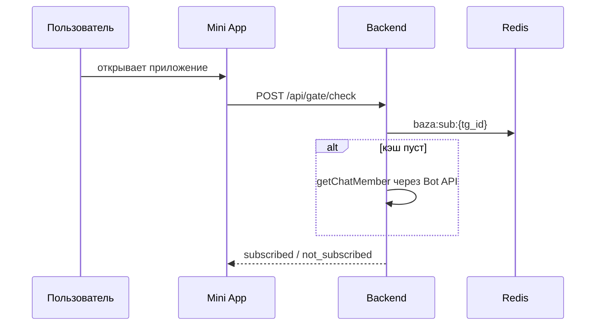

### ❓ Что это

Диаграмма в артефакте описывается текстом (обычно синтаксисом **Mermaid**) и рендерится в картинку. Ключевое отличие от сгенерированного изображения: схему можно править точечно — «поменяй стрелку между сервисом A и очередью на асинхронную» — и она перерисуется, а не сгенерируется заново с другим смыслом.

### 🎯 Зачем тебе

* **Правки предсказуемы.** Текстовое описание меняется детерминированно; картинка при регенерации «плывёт».
* **Схему можно унести в репозиторий.** Тот же текст вставляется в README или в документацию.
* **Ревью возможно.** Diff схемы читается как diff кода.

### 💻 Минимальный пример

```text
Нарисуй диаграмму последовательности через Mermaid: пользователь →
Mini App → backend → Redis (кэш подписки) → Telegram Bot API,
с веткой на случай, когда Telegram API недоступен и мы отдаём
последний известный статус из PostgreSQL.
```

Результат — блок вида:



### ⚠️ Грабли

* **Не всякий синтаксис поддерживается везде.** Схема, которая рендерится в артефакте, может не отрисоваться в вашем движке документации — проверяйте в целевой системе.
* **Сложные схемы разваливаются.** Больше десятка узлов — и Mermaid-раскладка становится нечитаемой; лучше разбить на несколько диаграмм.
* **Схема повторяет ваши слова, а не реальность.** Если вы описали архитектуру неточно, диаграмма аккуратно нарисует неточность.

### 🔗 Первоисточник

Документация Claude.ai: [support.claude.com](https://support.claude.com)
