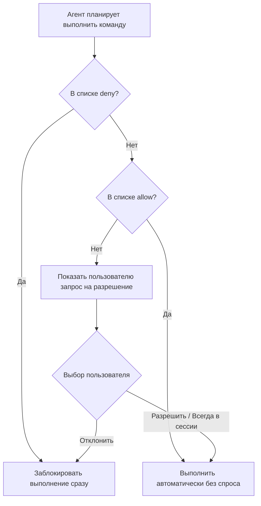

### ❓ Что это

Система разрешений Claude Code настраивает, какие действия требуют подтверждения человеком перед
исполнением, а какие разрешены автоматически — от режима «всё разрешено» (максимальная автономность,
минимум подтверждений) до «каждый шаг — явное подтверждение» (максимальная осторожность, минимум
автономности). Настраивается через allow/deny списки конкретных команд и путей, а не только общий
режим целиком.



### 🎯 Зачем тебе

Баланс между продуктивностью (не отвлекаться на подтверждение каждого безобидного `ls` или `git
status`) и безопасностью (обязательное подтверждение перед `rm -rf`, force push, изменением файлов
вне рабочей директории). Правильная настройка — не «максимальная автономность для скорости», а
осознанный выбор, какие категории действий действительно нужно доверить без подтверждения в
конкретном проекте.

### 💻 Минимальный пример

```json
{
  "permissions": {
    "allow": ["Bash(git status)", "Bash(npm test)", "Read(**)"],
    "deny": ["Bash(rm -rf *)", "Bash(git push --force*)"]
  }
}
```

Частые безопасные read-only команды — в allow-list, явно деструктивные — в deny-list вне зависимости
от общего режима.

### ⚠️ Грабли

- **«Разрешить всё» ради скорости — риск, а не оптимизация** — особенно при headless/автономных
  сессиях без человека, готового заметить неладное в реальном времени.
- **Приватные файлы (`.env`, ключи) нужно явно защищать** — не полагайся только на общий healthy
  sense агента не трогать секреты, deny-list на конкретные пути надёжнее.
- **Permissions настраиваются на уровне проекта/пользователя раздельно** — забытая локальная
  настройка более широкого allow-list в одном репозитории может неожиданно перенестись на другой,
  если конфиг скопирован бездумно.
- **Deny-list важнее allow-list для по-настоящему опасных операций** — allow-list ускоряет рутину, но
  именно явный запрет конкретных деструктивных паттернов (force push, `rm -rf`, запись за пределы
  проекта) — то, что реально защищает от катастрофического исхода при ошибке или неверной
  интерпретации задачи, allow-list сам по себе такой защиты не даёт.

### 🔗 Первоисточник
Permissions — docs.claude.com/en/docs/claude-code
