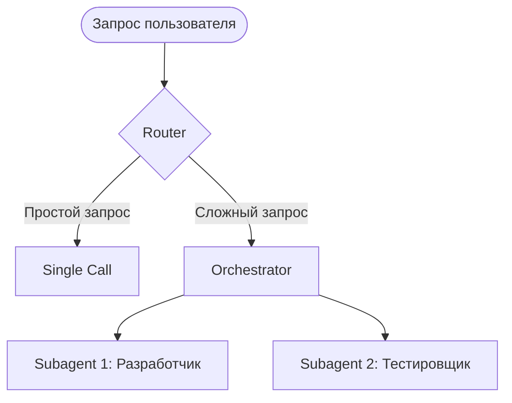

### ❓ Что это

Обзор архитектурных шаблонов разделения сложной задачи между специализированными вызовами модели —
расширение паттернов из «Building Effective Agents» применительно к разделению ролей: **Router**
(классифицирует вход, направляет в специализированный обработчик), **Orchestrator** (центральный
агент, динамически планирующий и делегирующий), **Subagents** (специализированные исполнители с
узкой ответственностью и изолированным контекстом).

#### Когда какой паттерн

Router — когда типов запросов конечное известное число и они не пересекаются. Orchestrator+Subagents
— когда задача заранее неизвестной формы и должна быть разбита динамически моделью. Комбинация —
Router на входе, Orchestrator внутри выбранной ветки.

### 🎯 Зачем тебе

Проектирование системы с более чем одним типом задач упирается в выбор: жёстко закодированная логика
ветвления или динамическое планирование моделью? Router дешевле и предсказуемее, Orchestrator гибче,
но менее предсказуем по стоимости.

### 💻 Минимальный пример

```python
# Router
category = haiku_classify(query)
handler = {"billing": handle_billing, "technical": handle_technical}.get(category, handle_generic)
return handler(query)

# Orchestrator
plan = sonnet_plan(query)
results = [execute_subtask(t) for t in plan.subtasks]
return synthesize(results)
```

### ⚠️ Грабли

- **Router на похожих категориях ошибается чаще** — нужны явные примеры (few-shot) в промпте
  классификатора.
- **Orchestrator без ограничения глубины** может породить рекурсивное дерево суб-агентов — закладывай
  потолок вложенности.
- **Смешение паттернов без чёткой границы ответственности** — частая архитектурная ошибка, теряется
  предсказуемость.

### 🔗 Первоисточник
Agentic design patterns — docs.claude.com
