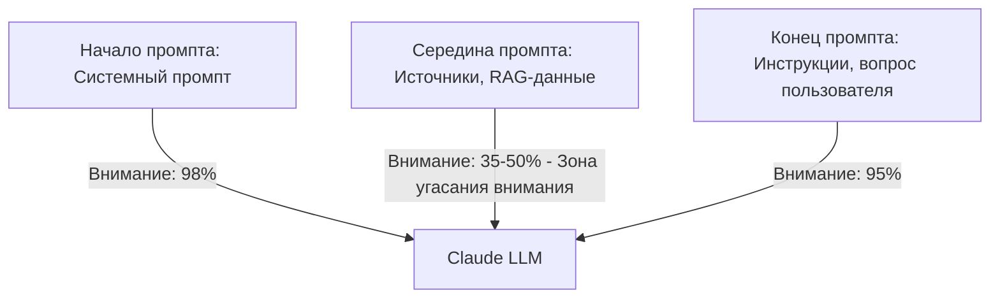

### ❓ Что это

Контекстное окно — не просто «сколько токенов помнит модель», а всё, что модель видит одновременно
перед генерацией: системный промпт, история сообщений, описания инструментов, содержимое файлов.
Внутри окна внимание распределяется неравномерно — эффект «lost in the middle»: информация в начале и
конце промпта учитывается надёжнее, чем зарытая в середине длинного контекста.

### 🎯 Зачем тебе

Если критично важное правило находится в середине огромного блока системного промпта, модель может
соблюдать его менее надёжно, чем если бы оно было в начале или продублировано ближе к концу перед
вопросом пользователя.

### 💻 Минимальный пример

Практическое правило размещения: критичные, неотменяемые инструкции — в начале системного промпта и
продублированы коротко в конце; объёмный справочный материал (документация, чанки RAG) — в середине,
там, где потеря внимания менее критична.

### ⚠️ Грабли

- **Больший лимит окна не отменяет эффект затухания внимания** — размер лимита и качество
  использования контекста — разные вещи.
- **Не путать с обрывом по лимиту** — это про качество внимания внутри ещё помещающегося контекста.
- **Слепое доверие «модель прочитает всё одинаково хорошо»** — частая причина несоблюдения важных
  правил из середины длинного промпта.
- **Эффект не абсолютный закон физики, а статистическая тенденция** — конкретный запрос может
  прекрасно сработать с важной деталью в середине промпта; проблема не в гарантированном провале
  каждый раз, а в повышенной вероятности, которую не стоит закладывать в критичные по надёжности
  сценарии.

### 🔗 Первоисточник
Context window — docs.claude.com
