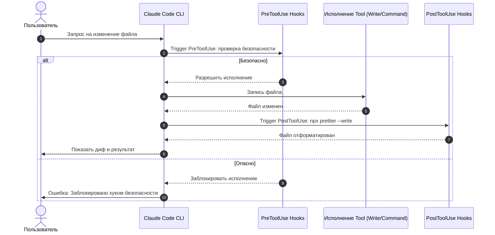

### ❓ Что это
**Hooks** — обработчики событий жизненного цикла Claude Code: команда, которая срабатывает в конкретный момент (например, после каждой правки файла, до выполнения bash-команды, в начале сессии) независимо от того, что «решила» сделать модель в этот раз. Это ключевое отличие от простой просьбы «пожалуйста, всегда форматируй код после правок» в CLAUDE.md — просьба может быть проигнорирована или забыта, hook сработает механически, каждый раз, без исключений.

Каждый hook — это связка: **событие** (что произошло) → **matcher** (фильтр — на какие именно действия реагировать) → **действие** (обычно shell-команда). События бывают разных типов: `PreToolUse` срабатывает до выполнения действия и может его заблокировать, `PostToolUse` — после, и может только среагировать на уже случившееся.

### 🎯 Зачем тебе
Форматирование кода после каждой правки, блокировка опасных команд до их выполнения, запрет коммита без прошедших тестов — всё это работает гарантированно каждый раз, а не зависит от того, вспомнит ли Claude запустить линтер сам в конкретной сессии. Hooks превращают пожелание в правило, которое невозможно случайно пропустить.

Это особенно ценно для команд: если у проекта есть строгие стандарты (обязательное форматирование, запрет прямых коммитов в main, обязательный прогон тестов), hooks гарантируют соблюдение этих стандартов для всех участников, использующих Claude Code, а не только для тех, кто помнит попросить об этом каждый раз.

### 💻 Как это выглядит на практике
Автоформатирование после любой правки файла, `.claude/settings.json`:
```json
{
  "hooks": {
    "PostToolUse": [
      {
        "matcher": "Write|Edit",
        "hooks": [{ "type": "command", "command": "npx prettier --write \"$CLAUDE_TOOL_INPUT_FILE_PATH\"" }]
      }
    ]
  }
}
```
После каждой правки файла эта команда запустится сама, без напоминаний.



Другие практические примеры использования hooks:
- **Блокировка опасных команд** — `PreToolUse` может проверить, не содержит ли команда `rm -rf`, и отклонить выполнение до того, как оно случится.
- **Обязательный прогон тестов перед коммитом** — hook на событие коммита запускает тестовый набор и блокирует коммит при провале.
- **Уведомления** — например, звуковой сигнал по завершении длинной задачи, чтобы не следить за терминалом постоянно.
- **Логирование действий** — запись всех выполненных команд в отдельный файл для аудита, что именно агент делал в сессии.

Matcher поддерживает регулярные выражения, так что можно точечно настраивать, на какие именно инструменты и файлы реагировать — например, применять форматирование только к `.ts`-файлам, игнорируя остальные.

### 🔗 Смотри в приложении
Базовые типы событий и примеры конфигов — в статье [«Hooks в Claude Code: автоматические триггеры на события»](entry:code-hooks-basics). Полигон с примерами всех 13 типов хуков — в разделе Софт: [disler/claude-code-hooks-mastery](tool:disler/claude-code-hooks-mastery).

### ⚠️ Частая ошибка новичка
Класть такие правила только в свой личный конфиг, а не в `.claude/settings.json` проекта. Личный конфиг работает только у тебя — если хочешь, чтобы гарантия действовала для всей команды, правило нужно закоммитить в проект, чтобы оно применялось у каждого, кто клонирует репозиторий и запускает Claude Code.

Вторая ошибка — путать `PreToolUse` и `PostToolUse` по назначению. `PostToolUse` может дать обратную связь и что-то поправить постфактум, но не может отменить уже выполненное действие — для реальной блокировки опасной команды до её выполнения нужен именно `PreToolUse`, иначе защита сработает слишком поздно.

### 🔗 Официальный источник
Anthropic Academy, курс «Claude Code 101», Module 4 «Customizing Claude Code» — anthropic.skilljar.com/claude-code-101; code.claude.com/docs/en/hooks
