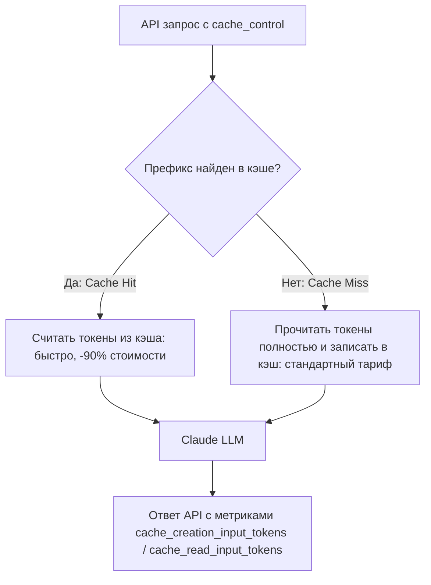

### ❓ Что это
**Prompt Caching** — технология Anthropic API, позволяющая временно кэшировать тяжёлые неизменяемые блоки контекста. Повторные запросы читают их из кэша вместо полного повторного прогона через модель — модель не «пережёвывает» один и тот же большой текст заново на каждом запросе, если он не изменился.

Это относится к использованию Claude через API (для своих приложений и интеграций), а не к обычному использованию claude.ai — в вебе кэширование происходит автоматически и прозрачно для тебя, а вот при работе с API за него нужно явно отвечать в коде.

### 🎯 Зачем тебе
Если бот через API анализирует большой репозиторий или документацию, без кэширования каждый запрос стоит полной цены за весь контекст заново — даже если единственное, что поменялось, это последний вопрос пользователя, а весь остальной контекст (документация, системные инструкции, история) идентичен предыдущему запросу. С кэшем полная цена платится один раз, все последующие обращения к тому же блоку — на порядок дешевле, вплоть до 90% экономии заявленной Anthropic.

Это критично важно для production-приложений с постоянным, объёмным системным контекстом — чат-боты поддержки с большой базой знаний, ассистенты по кодовой базе, любые системы, где один и тот же большой блок контекста используется снова и снова в разных запросах.

### 💻 Как это выглядит на практике
```python
response = client.messages.create(
    model="claude-sonnet-5",
    max_tokens=1024,
    system=[{
        "type": "text",
        "text": "Вся документация проекта...",
        "cache_control": {"type": "ephemeral"}
    }],
    messages=[{"role": "user", "content": "Найди баг в схеме БД"}]
)
```
Блок с `cache_control` кэшируется, следующие запросы с тем же блоком обходятся заметно дешевле.



Практические рекомендации по применению:
- **Кэшируй самое стабильное** — системные инструкции, справочная документация, большие кодовые базы — то, что не меняется от запроса к запросу.
- **Не кэшируй то, что меняется каждый раз** — сам пользовательский вопрос кэшировать бессмысленно, он и так уникален на каждый запрос.
- **Структурируй промпт так, чтобы кэшируемая часть шла в начале** — это стандартная практика, совпадающая с тем, что ты уже знаешь про контекстное окно из прошлого урока: стабильные, важные блоки логично располагать в начале.
- **Мониторь фактическую экономию** — в ответе API возвращается информация о том, сколько токенов было прочитано из кэша, а сколько обработано заново — стоит явно проверять эти цифры, а не считать кэширование работающим по умолчанию.

### ⚠️ Частая ошибка новичка
Забывать, что кэш живёт всего 5 минут с момента последнего запроса (есть платная опция часового кэша по повышенной цене записи). Если запросы идут реже — кэш просто не успевает сработать, и ты платишь полную цену каждый раз, как будто кэширования и не было вовсе, хотя код формально его использует.

Вторая ошибка — пытаться кэшировать слишком маленькие блоки контекста. Есть минимальный порог объёма для эффективного кэширования (порядка 1–2 тысяч токенов у Sonnet/Opus, больше у Haiku — точный порог стоит сверять в актуальной документации перед реализацией) — кэширование пары предложений просто не даст заметной экономии и добавит ненужную сложность коду без реальной пользы.

### 🔗 Смотри в приложении
Механика кэша, TTL и цифры экономии — в статье [«Prompt Caching: снижение затрат до 90%»](entry:api-prompt-caching). Прикинуть, сколько токенов реально уходит на твой контекст — калькулятор токенов на Home.

### 🔗 Официальный источник
Anthropic Academy, курс «Building with the Claude API», Module 7 «Features of Claude» — anthropic.skilljar.com/claude-with-the-anthropic-api; platform.claude.com — Prompt Caching
